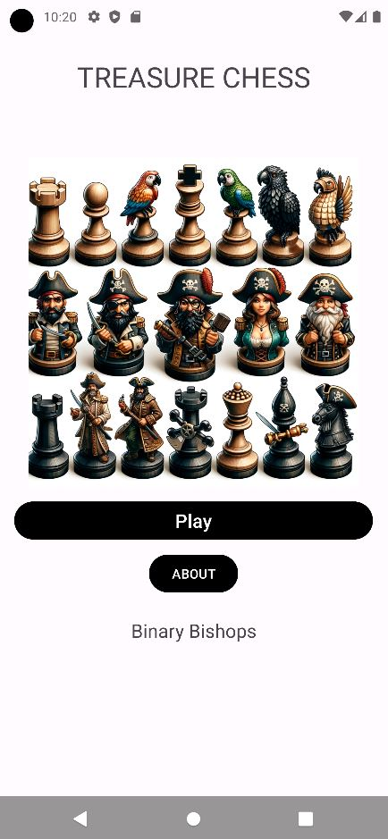
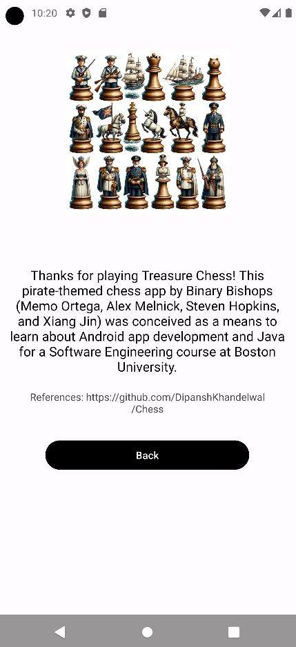
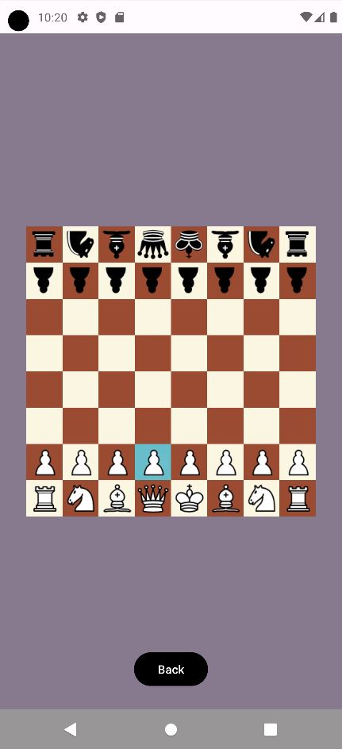

# Treasure Chess (lauded by the Binary Bishops)

This is a chess game app developed on the Android environment that serves as a way for players to play chess in a handheld format without much intervention from the software, allowing for much less overhead compared to contemporary chess apps. 
It is ideal for outdoor play or in situations where setting up a physical chess board would be inconvenient.

## Screenshots

    
     
    

## References:
1. Khandelwal, Dipansh, Onur Yavri, Audie Maven. 2019. Chess. https://github.com/DipanshKhandelwal/Chess.git. (2023).